# Boğaziçi University SWE574 Final Project Report for Group 2

**Project Name: Stufffinder**
**Group Members: Melih Güney, Mustafa Beştaş, Mert Ünlü**
Due Date: 18.05.2025

- Repository: <https://github.com/rmguney/swe574-2025s-g2>
- Wiki: <https://github.com/rmguney/swe574-2025s-g2/wiki>
- Deployment: <https://frontend-310608491068.europe-west1.run.app>
- Mobile Build: <https://github.com/rmguney/swe574-2025s-g2/blob/main/stufffinder.apk>
- Available Releases: <https://github.com/rmguney/swe574-2025s-g2/tags>
- Final Release: <https://github.com/rmguney/swe574-2025s-g2/releases/tag/0.9.0>
- Demonstration Video: <https://drive.google.com/file/d/106qS6w68KmGpNZpGShuHE9eS7KJ97gZA/view?usp=sharing>

All the work in the project is performed by the group members, except the enabling technologies declared in the tech stack below:

| Component  | Technology       |
|------------|------------------|
| Frontend   | SvelteKit        |
| Mobile     | Capacitor        |
| Backend    | Java Spring Boot |
| Container  | Docker           |
| Database   | AWS RDS MySQL    |
| Deployment | Google Cloud Run |

## Table of Contents

- [1. Requirements Specification and Status](#1-requirements-specification-and-status)
  - [1.1. User Management](#11-user-management)
        - [1.1.1. User Registration and Authentication](#111-user-registration-and-authentication)
        - [1.1.2. User Profiles](#112-user-profiles)
        - [1.1.3. User Roles](#113-user-roles)
  - [1.2. Post Creation and Management](#12-post-creation-and-management)
        - [1.2.1. Media Upload](#121-media-upload)
        - [1.2.2. Post Status](#122-post-status)
        - [1.2.3. Mystery Object Resolution](#123-mystery-object-resolution)
  - [1.3. Interaction and Feedback](#13-interaction-and-feedback)
        - [1.3.1. Commenting System](#131-commenting-system)
        - [1.3.2. Answer Recognition](#132-answer-recognition)
        - [1.3.3. Voting Mechanism](#133-voting-mechanism)
  - [1.4. Search and Navigation](#14-search-and-navigation)
        - [1.4.1. Search Functionality](#141-search-functionality)
        - [1.4.2. Tagging](#142-tagging)
  - [1.5. Notifications and Alerts](#15-notifications-and-alerts)
        - [1.5.1. User Notifications](#151-user-notifications)
        - [1.5.2. System Alerts](#152-system-alerts)
  - [1.6. Reputation and Badge System](#16-reputation-and-badge-system)
- [2. System Design Mockups](#2-system-design-mockups)
- [3. System Diagrams](#3-system-diagrams)
- [4. Docker Quickstart Manual](#4-docker-quickstart-manual)
- [5. Local Quickstart Manual](#5-local-quickstart-manual)
- [6. User Manual](#6-user-manual)
- [7. Test Results](#7-test-results)
  - [7.1. Unit Tests](#71-unit-tests)
  - [7.2. Manual Tests](#72-manual-tests)
- [8. Individual Contributions for Melih Güney](#8-individual-contributions-for-melih-güney)
- [9. Individual Contributions for Mustafa Bektaş](#9-individual-contributions-for-mustafa-bektaş)
- [10. Individual Contributions for Mert Ünlü](#10-individual-contributions-for-mert-ünlü)

## 1. Requirements Specification and Status

Following requirements are gathered and met with the final release of the software:

## 1.1. User Management

### 1.1.1. User Registration and Authentication

- 1.1.1.1. Users should be able to register using a unique username and password.  
- 1.1.1.2. The system should provide login and logout functionalities for registered users.  

### 1.1.2. User Profiles  

- 1.1.2.1. When successfully registered, the system should create a user profile containing mandatory fields such as username and email address.
- 1.1.2.2. Users should be able to add a biography information as optional to their profile.
- 1.1.2.3. Users should be able to upload a profile picture.
- 1.1.2.4. Users should be able to update their profile information from the profile page.
- 1.1.2.5. Users should be able to view the badges they have earned from the profile page.

### 1.1.3. User Roles

- 1.1.4.1. The system shall support user roles including: registered user and moderator.  
- 1.1.4.2. Registered Users can search, comment, upvote/downvote, create and edit their own posts.  
- 1.1.4.3. Moderator users shall have the ability to manage user-generated content such as deleting posts and comments that violate platform policies and receiving moderation alerts.  

## 1.2. Post Creation and Management

- 1.2.1.1. The system shall allow users to create a new post by filling in a structured form including these mandatory fields:
  - **Title:** A concise summary of the mystery object.
  - **Description:** A detailed explanation of why the object is mysterious whether it has any known background information. Users should also describe their personal experience or the story behind discovering the object. They should explain any context that may help in its identification.
  - **Multi-Media Content:** At least one image or video is required to provide visual context to have clarity for identification. Audio content is optional but can be included for additional context.

- 1.2.1.2. Users should have the option to provide additional structured details about the mystery object, categorized as follows:
  - **Physical Characteristics:** Material, dimensions (length, width, height), shape, weight, color, texture.
  - **Sensory Attributes:** Smell (if applicable).
  - **Contextual Information:** Location of discovery, estimated age, origin of acquisition, price and cultural association.
  - **Functional Attributes:** Potential usage, movable components, assembled/disassembled components.
  - **Identification Features:** Marks, labels, inscriptions, symbols, patterns.

- 1.2.1.3. The system should provide a structured form and predefined input fields for relevant attributes (dropdown lists for material types, numerical inputs for dimensions and weight) while also allowing free-text input for unknown characteristics.  
- 1.2.1.4. The system should allow users to tag their posts with semantic tags from Wikidata for better insight.  
- 1.2.1.5. The original post creator (Registered or Expert user) shall be able to edit their post via the "Edit" button on the post detail page. Edits shall overwrite the previous version and update the "last modified" timestamp.  

### 1.2.1. Media Upload

- 1.2.2.1. Users should be able to upload multi-media files like images or videos as mandatory and audio as optional to accompany their posts.  
- 1.2.2.2. The system should support common media formats.  

### 1.2.2. Post Status

- 1.2.3.1. Users should have the ability to mark their posts as "Solved" to indicate the current status of the inquiry.  
- 1.2.3.2. The system should display the status of each post prominently to inform other users about its current state.  
- 1.2.3.3. When a post is marked as "Solved", the system should prominently display the resolution content as defined in 2.4.2.  
- 1.2.3.4. The post owner should acknowledge and credit the users who commented or contributed in solving the mystery by manually selecting them. The system should highlight their input in the solution summary.  
- 1.2.3.5. Post owners must be able to change the status of a post from "Solved" back to "Unsolved" if the solution is later found to be incorrect.  

### 1.2.3. Mystery Object Resolution

- 1.2.4.1. The system shall provide a "Mark as Solved" feature accessible to the original post creator.
  - When clicked, it shall open a "Submit Resolution" modal or page.
  - This interface must require the user to provide structured resolution content.
- 1.2.4.2. Resolution Content must include the following elements:  
  - Confirmed Identification
    - A short, free-text input where the post owner states the name or category of the identified object.  
    - Example: “Victorian-era wax-resist drawing tool.”  
  - Descriptive Explanation
    - A rich-text editor where the user describes how the object was identified.  
    - Optional image upload field.  
  - Manual selection of comments that contributed to solving the mystery. These referenced comments must be recorded and displayed as part of the resolution.  
- 1.2.4.3. The system must highlight all users whose comments were referenced in the resolution, as part of the reward and reputation mechanism.  
- 1.2.4.4. Post creators shall have access to a "Revert to Unsolved" button on the post detail page, visible only when the post is in a solved state.  
  - The system shall prompt the user to provide a required justification (free-text field).  
  - The action shall be timestamped and appended to the post’s resolution history log.  
- 1.2.4.5. The resolution system must be integrated as a feature extension of the existing Post Detail view.
  - If the post is unsolved, show a “Mark as Solved” button for the owner.
  - If solved, display the full resolution summary and contributor list.  

## 1.3. Interaction and Feedback

### 1.3.1. Commenting System

- 1.3.1.1. Users should be able to select a comment type when adding a comment, such as **question**, **hint**, **answer suggestion**, or **personal experience** related to the object's usage in their life.  
- 1.3.1.2. The system should support threaded comments to have organized discussions and replies.
- 1.3.1.3. The system should support various types of interactions for comments. For example, discussions, expert opinions, speculative answers and solution proposal.  
- 1.3.1.4. The system should support multi-media content for comments and should allow users to attach multiple images to illustrate their points and provide visual evidence.

### 1.3.2. Answer Recognition

- 1.3.2.1. Post authors should have the capability to mark specific comment as "Solved" if they find them helpful in addressing its inquiry.  
- 1.3.2.2. Users should receive badges when they reach certain reputation levels.  
- 1.3.2.3. Solved comments should be highlighted in the comment section.  

### 1.3.3. Voting Mechanism

- 1.3.3.1. Users should have the ability to upvote or downvote posts and comments based on their usefulness, accuracy or relevance.  
- 1.3.3.2. The system should display the vote count for each post and comment to provide feedback on community perception.  
- 1.3.3.3. Highly upvoted content may be featured or ranked higher in search results to enhance visibility.  

## 1.4. Search and Navigation

### 1.4.1. Search Functionality

- 1.4.1.1. The platform should provide a search feature that allows users to find posts based on:
  - Keywords (title, description)
  - Tags (user-defined tags and semantic tags from Wikidata)
- 1.4.1.2. The platform should provide an advanced search feature that allows users to filter posts based on:
  - Optional attributes (color, price, location, material, shape, texture, markings, functionality, time period, hardness, pattern, dimensions, weight, handmade, one of a kind, written text, origin of acquisition)
- 1.4.1.3. The advanced search filter options should provide addition and removal according to user's needs.
- 1.4.1.4. The advanced search should provide range options (e.g., dimensions, weight) as well as unit selection options for metric attributes (g/kg, cm/m). Users should be able to manually select their preferred options.
- 1.4.1.5. Search results should be sortable and filterable based on these options:
  - Date (newest to oldest or oldest to newest)
  - Relevance (matches closest to the search query)
  - Status (solved/unsolved objects)
  - Most Trending (most upvotes)

### 1.4.2. Tagging

- 1.4.2.1. Users should have the ability to tag posts with relevant keywords to facilitate organized navigation and improve searchability.
- 1.4.2.2. The system should support the creation, management of tags and should allow users to use semantic tags linked to Wikidata
- 1.4.2.3. Tagging and searching are separate but interconnected features:
  - Tagging helps categorize mystery objects for better organization.
  - Searching retrieves objects based on input criteria. For example, including tags, text, and metadata.
- 1.4.2.4. The system should recommend posts to the users based on Wikidata tags.

## 1.5. Notifications and Alerts

### 1.5.1. User Notifications

- 1.5.1.1. The system should notify users when they receive a comment on their post.
- 1.5.1.2. Users should receive notifications when their comment is marked as contributing to the solution of a mystery object.
- 1.5.1.3. Users should be notified if their post or comment is upvoted or downvoted.

### 1.5.2. System Alerts

- 1.5.2.1. The system should alert users when submitting inappropriate content.  
- 1.5.2.2. Moderators should receive alerts when a post or comment is reported.  
- 1.5.2.3. Users must be able to report inappropriate or misleading content with a required reason (hate speech, bullying, misleading).
- 1.5.2.4. Moderators should have access to a moderation view that lists all reported posts and comments along with report reasons.  

## 1.6. Reputation and Badge System

- 1.6.1. The system must implement a merit-based reputation system where users earn points for valuable contributions, such as helping to solve posts.
- 1.6.2. Badges  must reflect activity-based contributions and cannot be self-declared.
- 1.6.3. The system must prevent abuse by introducing increasing thresholds for point accumulation.

## 2. System Design Mockups

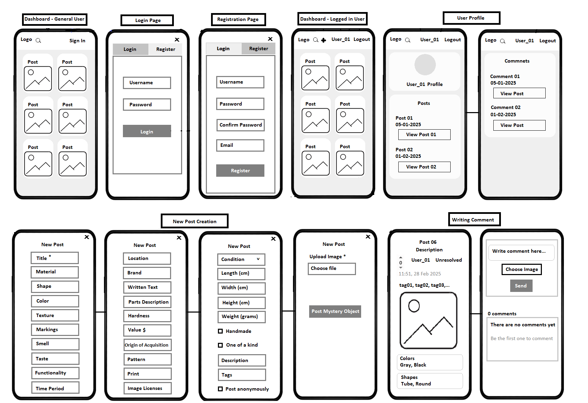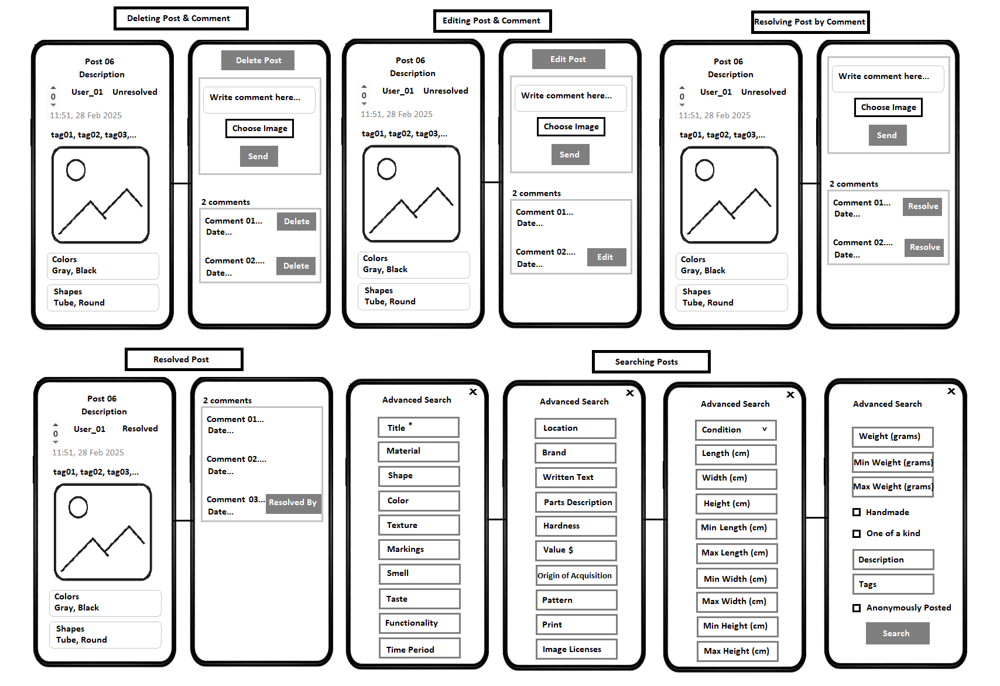

### 2.1 Mockups for web app

**2.1.1. Dashboard, user is not logged in.**
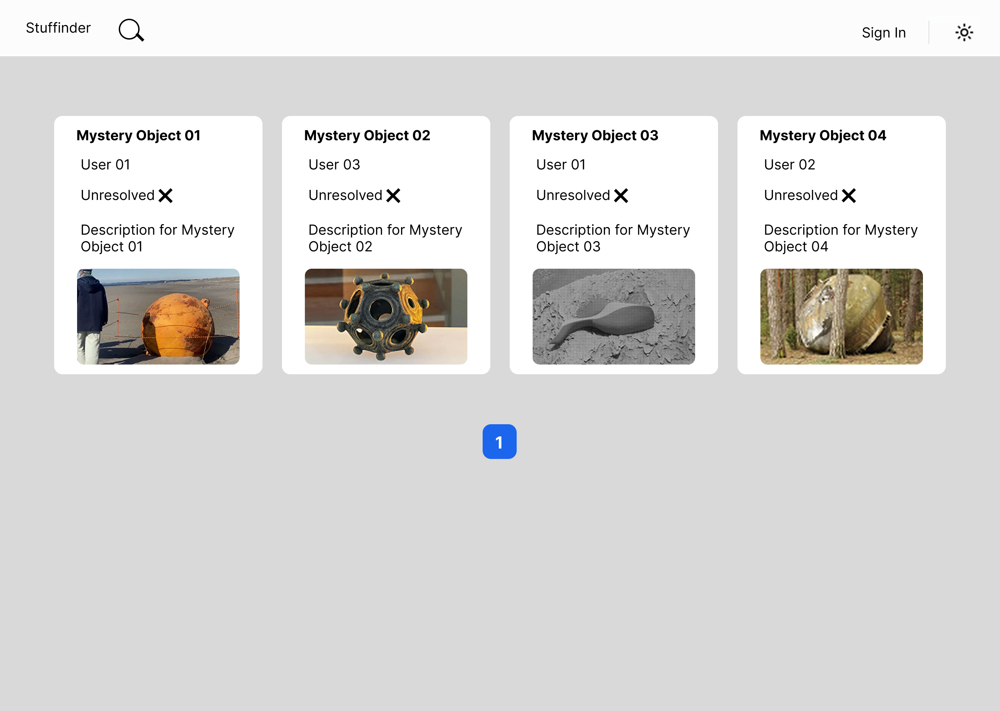

**2.1.2. Dashboard, user is logged in.**

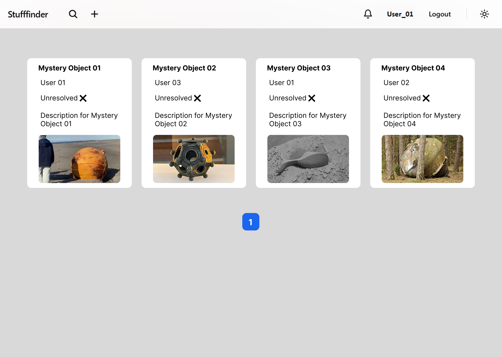

**2.1.3. Login and registeration form.**

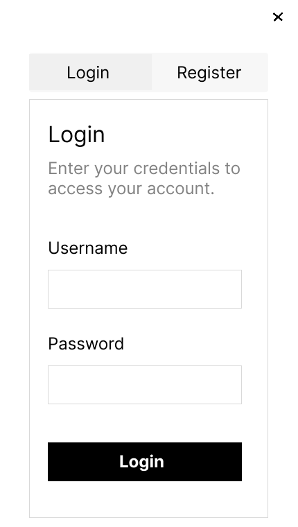

### 2.2. Mockups for mobile app

**2.2.1. Dashboard, user is not logged in.**

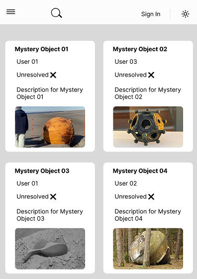

**2.2.2. Dashboard, user is logged in.**

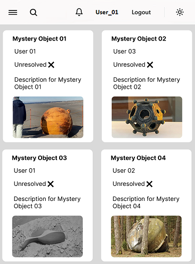

## 3. System Diagrams

### Entity-Relationship Diagram

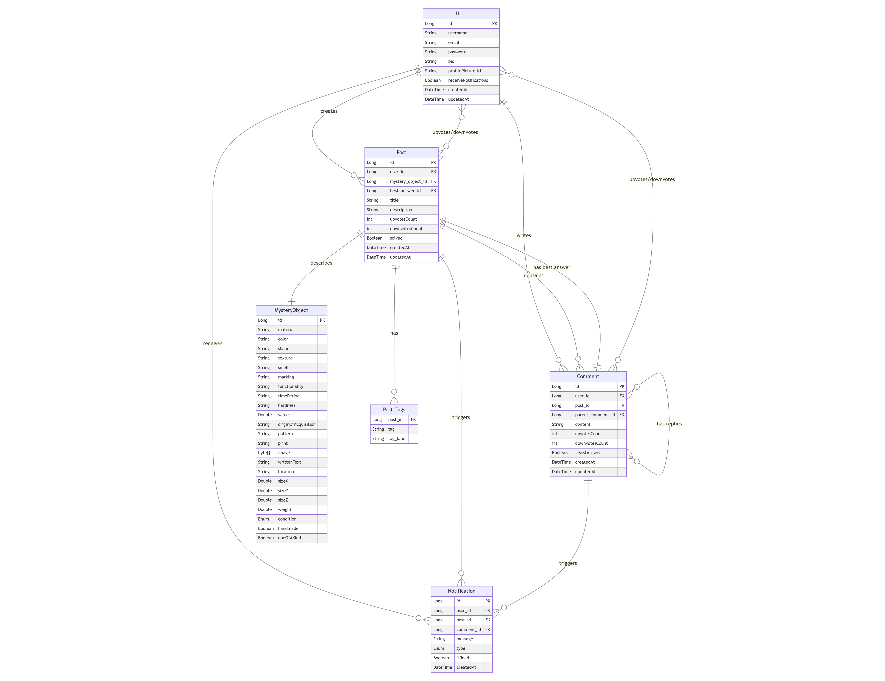

### Sequence Diagram for Post Creation


### Sequence Diagram for Commenting

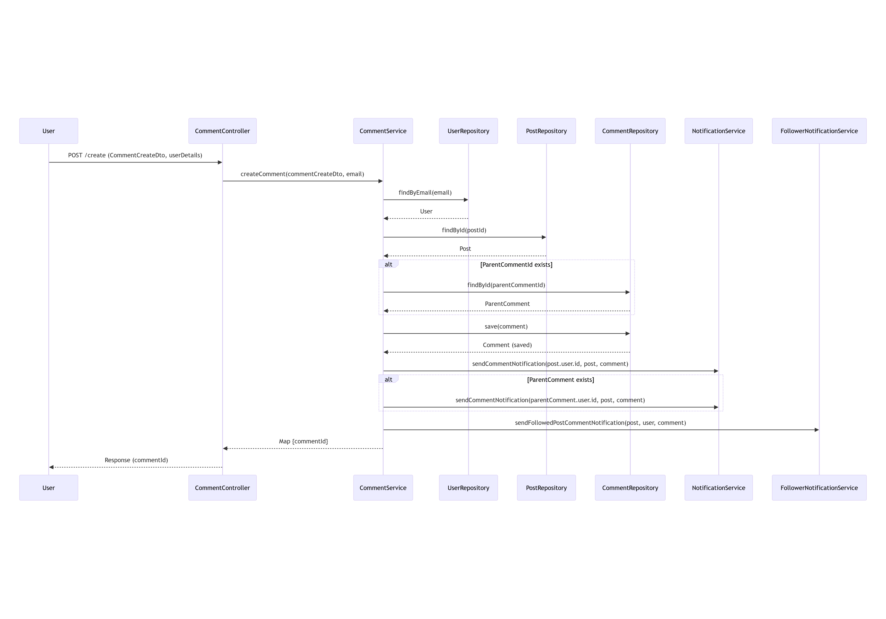

## 4. Docker Quickstart Manual

### 4.1. Backend (Composed Java Maven App)

Requirements:

- Docker installed
- Java Maven project (`pom.xml` and `src` folder)

Build Image:

```bash
docker build -t java-app .
```

Run Container:

```bash
docker run -p 8080:8080 java-app
```

Access backend at: `http://localhost:8080`

### 4.2. Frontend (Composed Svelte Node App)

Requirements:

- Docker installed
- Svelte app with `package.json` and `svelte.config.js`

Build Image:

```bash
docker build -t svelte-app .
```

Run Container:

```bash
docker run -p 4200:4200 svelte-app
```

Access frontend at: `http://localhost:4200`

Stop Containers:

```bash
docker stop [container_id]
```

## 5. Local Quickstart Manual

### 5.1. Backend (Java Maven App)

Requirements:

- Java 17 installed
- Maven 3.8+ installed

Run the Backend:

```bash
mvn spring-boot:run
```

Backend will run at: `http://localhost:8080`

### 5.2 Frontend (Svelte Node App)

Requirements:

- npm (comes with Node.js)

Install dependencies:

```bash
npm install
```

Run the Frontend:

```bash
npm run dev
```

Frontend will run at: `http://localhost:4200`

Ensure both backend and frontend are running to test the complete application locally.

## 6. User Manual

### 6.1. Getting Started

- **Access the Platform:**  
  Visit the web app at [Deployment URL](https://frontend-310608491068.europe-west1.run.app) or install the mobile app from the provided APK.
- **Register an Account:**  
  Click "Register" and fill in the required fields (username, email, password).  
  After registration, log in with your credentials.

### 6.2. User Profile

- **View/Edit Profile:**  
  Access your profile from the navigation menu.  
  Update your biography, upload a profile picture, and review your badges and activity.
- **Badges:**  
  Earn badges by contributing to the platform (e.g., solving mysteries, receiving upvotes).

### 6.3. Creating and Managing Posts

- **Create a Post:**  
  Click "Create Post" and fill in the structured form:
  - Title, description, and at least one uploaded multimedia.
  - Add physical, sensory, contextual, and functional details as prompted.
  - Tag your post with relevant keywords and semantic tags (Wikidata).
- **Mark as Solved/Unsolved:**  
  If your mystery is resolved, click "Mark as Solved" and provide a resolution summary, select contributing comments, and optionally upload supporting media.  
  You can revert to "Unsolved" with a justification if needed.

### 6.4. Commenting and Interaction

- **Add Comments:**  
  On any post, add a comment by selecting a comment type (question, hint, answer suggestion, personal experience) and optionally attach images.
- **Threaded Discussions:**  
  Reply to comments to create organized, threaded discussions.
- **Mark Helpful Comments:**  
  As a post owner, highlight comments that contributed to the solution.

### 6.5. Voting and Reputation

- **Upvote/Downvote:**  
  Vote on posts and comments to indicate usefulness or relevance.
- **Reputation Points:**  
  Earn points for valuable contributions; higher reputation unlocks badges and visibility.

### 6.6. Search and Navigation

- **Basic Search:**  
  Use the search bar to find posts by keywords or tags.
- **Advanced Search:**  
  Filter posts by attributes (color, material, location, etc.), status, date, and more.
- **Sorting:**  
  Sort results by date, relevance, status, or trending.

### 6.7. Notifications and Alerts

- **User Notifications:**  
  Receive notifications for new comments, upvotes, and when your comment is marked as helpful.
- **System Alerts:**  
  Get alerts for inappropriate content or moderation actions.

### 6.8. Reporting and Moderation

- **Report Content:**  
  Report posts or comments for inappropriate or misleading content, providing a reason.
- **Moderation Panel:**  
  (For moderators) Access the moderation view to review and manage reported content.

### 6.9. Mobile App Usage

- **Install the App:**  
  Download and install the APK from the provided link.
- **Mobile Features:**  
  All core features are available on mobile, with a responsive interface for easy navigation.

### 6.10. Troubleshooting

- **Common Issues:**  
  If you encounter errors, check your internet connection and ensure you are using a supported browser or device.
- **Support:**  
  For further help, refer to the project Wiki or contact the development team via the repository.

## 7. Test Results

### 7.1 Unit Tests

The following screenshot summarizes the backend code coverage as measured by our test suite:

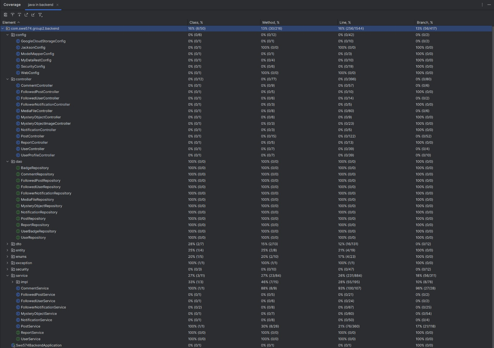

- **Repositories** are fully covered (100%) due to Spring Data JPA auto-generated code and simple CRUD operations.
- **Entities, DTOs, Enums** do not need direct coverage since they are data structures.
- **Controllers** and **Config** classes are covered by Spring Boot framework iteself.
- **Service Implementations** have coverage on crucial parts, with some core business logic tested.

| No | Method Name                                          | Tested Feature   | Description                                                                      | Result |
|----|------------------------------------------------------|------------------|----------------------------------------------------------------------------------|--------|
| 1  | createComment_success                                | Comment Service  | Verifies successful creation of a comment linked to a post.                     | Passed |
| 2  | createComment_withParentComment_success              | Comment Service  | Tests adding a nested (child) comment to another comment.                       | Passed |
| 3  | createComment_userNotFound_throwsException           | Comment Service  | Ensures exception if user creating the comment is not found.                    | Passed |
| 4  | createComment_postNotFound_throwsException           | Comment Service  | Ensures exception if the target post does not exist.                            | Passed |
| 5  | createComment_parentCommentNotFound_throwsException  | Comment Service  | Tests exception when parent comment is not found for nesting.                   | Passed |
| 6  | getCommentsForPost_success                           | Comment Service  | Retrieves comments for a given post successfully.                               | Passed |
| 7  | getCommentsForPost_noUserEmail_success               | Comment Service  | Retrieves comments without needing user email.                                  | Passed |
| 8  | upvoteComment_newUserUpvote_success                  | Comment Service  | Upvote by a new user works as expected.                                         | Passed |
| 9  | upvoteComment_removeExistingUpvote_success           | Comment Service  | Removes the user's upvote if it exists.                                         | Passed |
| 10 | upvoteComment_removeDownvoteAndAddUpvote_success     | Comment Service  | Converts a downvote to upvote.                                                  | Passed |
| 11 | downvoteComment_newDownvote_success                  | Comment Service  | User downvotes a comment successfully.                                          | Passed |
| 12 | downvoteComment_removeExistingDownvote_success       | Comment Service  | Removes existing downvote.                                                      | Passed |
| 13 | downvoteComment_removeUpvoteAndAddDownvote_success   | Comment Service  | Converts upvote to downvote.                                                    | Passed |
| 14 | getUserComments_success                              | Comment Service  | Fetches all comments of a user.                                                 | Passed |
| 15 | getUserComments_userNotFound_throwsException         | Comment Service  | Ensures exception if user is not found.                                         | Passed |
| 16 | editComment_success                                  | Comment Service  | Tests successful comment edit.                                                  | Passed |
| 17 | editComment_notAuthor_throwsForbiddenException       | Comment Service  | Prevents non-author from editing.                                               | Passed |
| 18 | editComment_commentNotFound_throwsException          | Comment Service  | Exception when editing non-existing comment.                                    | Passed |
| 19 | editComment_onlyContentUpdate_success                | Comment Service  | Updates only content without changing metadata.                                 | Passed |
| 20 | whenCreatePost_thenReturnPostDetails                 | Post Service     | Creates post and verifies returned data.                                        | Passed |
| 21 | whenGetPostDetails_thenReturnPostDetails             | Post Service     | Fetches post details using postId.                                              | Passed |
| 22 | getUserProfile_UserExists_ReturnsUserProfileDto      | User Service     | Gets profile data of an existing user.                                          | Passed |
| 23 | getUserProfile_UserNotExists_ThrowsResourceNotFound  | User Service     | Ensures exception when user is not found.                                       | Passed |
| 24 | updateUserProfile_UserExists_ReturnsUpdatedDto       | User Service     | Updates user profile and returns new data.                                      | Passed |
| 25 | updateUserProfile_UserNotExists_ThrowsResourceNF     | User Service     | Exception on update when user not found.                                        | Passed |
| 26 | updateUserProfile_JsonProcessingException_ThrowsRT   | User Service     | Handles JSON processing exception.                                              | Passed |
| 27 | updateUserProfile_NullLocation_UsesEmptyList         | User Service     | Treats null location as empty.                                                  | Passed |
| 28 | updateProfilePicture_UserExists_FileValid_ReturnsUrl | User Service     | Valid profile image upload returns URL.                                         | Passed |
| 29 | updateProfilePicture_UserNotExists_ThrowsResourceNF  | User Service     | Throws error for image upload of non-existent user.                             | Passed |
| 30 | updateProfilePicture_FileNull_ThrowsIllegalArg       | User Service     | Throws IllegalArgumentException if file is null.                                | Passed |
| 31 | updateProfilePicture_FileEmpty_ThrowsIllegalArg      | User Service     | Ensures error on uploading empty file.                                          | Passed |
| 32 | updateProfilePicture_IOExceptionOnGetBytes_ThrowsIO  | User Service     | Handles IOException while reading file.                                         | Passed |
| 33 | getUserBadges_UserExists_HasBadges_ReturnsList       | User Service     | Returns user badges if they exist.                                              | Passed |
| 34 | getUserBadges_UserExists_NoBadges_ReturnsEmpty       | User Service     | Returns empty list if user has no badges.                                       | Passed |
| 35 | getUserBadges_UserNotExists_ThrowsResourceNotFound   | User Service     | Throws error if badges fetched for non-existent user.                           | Passed |
| 36 | getAllBadges_BadgesExist_ReturnsBadgeList            | User Service     | Returns all system badges.                                                      | Passed |
| 37 | getAllBadges_NoBadgesExist_ReturnsEmptyList          | User Service     | Returns empty list if no badges in system.                                      | Passed |

#### Test Method: createComment_success

**Scenario**: A user creates a new comment on an existing post.  
**Expected Result**: The comment is successfully saved and linked to the target post.  
**Actual Result**: Passed

#### Test Method: createComment_withParentComment_success

**Scenario**: A user adds a nested (child) comment as a response to a comment.  
**Expected Result**: The child comment is created and linked to the correct parent comment.  
**Actual Result**: Passed

#### Test Method: createComment_userNotFound_throwsException

**Scenario**: A comment creation is attempted by a user that do
es not exist in the system.  
**Expected Result**: The system throws a ResourceNotFoundException.  
**Actual Result**: Passed

#### Test Method: createComment_postNotFound_throwsException

**Scenario**: User tries to add a comment to a post that does not exist.  
**Expected Result**: The system throws a ResourceNotFoundException.  
**Actual Result**: Passed

#### Test Method: createComment_parentCommentNotFound_throwsException

**Scenario**: User tries to reply to a non-existent parent comment.  
**Expected Result**: The system throws a ResourceNotFoundException.  
**Actual Result**: Passed

#### Test Method: getCommentsForPost_success

**Scenario**: Retrieve all comments related to a specific post by its ID.  
**Expected Result**: The system returns a list of comments linked to that post.  
**Actual Result**: Passed

#### Test Method: getCommentsForPost_noUserEmail_success

**Scenario**: Retrieve comments for a post without providing a user email.  
**Expected Result**: The system returns public comments, excluding user-specific data.  
**Actual Result**: Passed

#### Test Method: upvoteComment_newUserUpvote_success

**Scenario**: A user upvotes a comment for the first time.  
**Expected Result**: The comment’s upvote count increases by one.  
**Actual Result**: Passed

#### Test Method: upvoteComment_removeExistingUpvote_success

**Scenario**: A user who previously upvoted the comment clicks upvote again to remove it.  
**Expected Result**: The existing upvote is removed and reduced the vote count by one.  
**Actual Result**: Passed

#### Test Method: upvoteComment_removeDownvoteAndAddUpvote_success

**Scenario**: A user changes their previous downvote to an upvote on a comment.  
**Expected Result**: The downvote is removed and an upvote is added.  
**Actual Result**: Passed

#### Test Method: downvoteComment_newDownvote_success

**Scenario**: A user downvotes a comment for the first time.  
**Expected Result**: The comment’s downvote count increases by one.  
**Actual Result**: Passed

#### Test Method: downvoteComment_removeExistingDownvote_success

**Scenario**: A user removes their existing downvote from a comment.  
**Expected Result**: The downvote is removed and decreased the vote count.  
**Actual Result**: Passed

#### Test Method: downvoteComment_removeUpvoteAndAddDownvote_success

**Scenario**: A user switches their upvote to a downvote on a comment.  
**Expected Result**: The upvote is removed and a downvote is applied.  
**Actual Result**: Passed

#### Test Method: getUserComments_success

**Scenario**: Retrieve all comments made by a specific user.  
**Expected Result**: The system returns the user's comment list.  
**Actual Result**: Passed

#### Test Method: getUserComments_userNotFound_throwsException

**Scenario**: Attempt to retrieve comments for a non-existent user.  
**Expected Result**: The system throws a ResourceNotFoundException.  
**Actual Result**: Passed

#### Test Method: editComment_success

**Scenario**: A user edits the content of their own comment.  
**Expected Result**: The comment is updated and saved with the new content.  
**Actual Result**: Passed

#### Test Method: editComment_notAuthor_throwsForbiddenException

**Scenario**: A non-author user attempts to edit someone else’s comment.  
**Expected Result**: The system throws a ForbiddenException, preventing unauthorized edit.  
**Actual Result**: Passed

#### Test Method: editComment_commentNotFound_throwsException

**Scenario**: A user tries to edit a comment that no longer exists.  
**Expected Result**: The system throws a ResourceNotFoundException.  
**Actual Result**: Passed

#### Test Method: editComment_onlyContentUpdate_success

**Scenario**: A user updates only the text content of a comment without changing other fields.  
**Expected Result**: The content is updated successfully; other fields remain unchanged.  
**Actual Result**: Passed

#### Test Method: whenCreatePost_thenReturnPostDetails

**Scenario**: A user creates a new post with required fields.  
**Expected Result**: The post is saved and its details (postId) are returned.  
**Actual Result**: Passed

#### Test Method: whenGetPostDetails_thenReturnPostDetails

**Scenario**: Retrieve detailed information of a post by its ID.  
**Expected Result**: The system returns correct post data, including title, description and tags.  
**Actual Result**: Passed

#### Test Method: getUserProfile_UserExists_ReturnsUserProfileDto

**Scenario**: Retrieve profile information of an existing user.  
**Expected Result**: UserProfileDto is returned with correct data.  
**Actual Result**: Passed

#### Test Method: getUserProfile_UserNotExists_ThrowsResourceNotFoundException

**Scenario**: Attempt to fetch profile of a non-existent user.  
**Expected Result**: The system throws a ResourceNotFoundException.  
**Actual Result**: Passed

#### Test Method: updateUserProfile_UserExists_ReturnsUpdatedUserProfileDto

**Scenario**: A user updates their profile details (bio, location, etc.).  
**Expected Result**: Profile is updated, and updated UserProfileDto is returned.  
**Actual Result**: Passed

#### Test Method: updateUserProfile_UserNotExists_ThrowsResourceNotFoundException

**Scenario**: Update is attempted for a user that does not exist.  
**Expected Result**: The system throws a ResourceNotFoundException.  
**Actual Result**: Passed

#### Test Method: updateUserProfile_JsonProcessingException_ThrowsRuntimeException

**Scenario**: JSON processing error occurs during profile update.  
**Expected Result**: The system throws a RuntimeException.  
**Actual Result**: Passed

#### Test Method: updateUserProfile_NullLocation_UsesEmptyList

**Scenario**: User updates profile but leaves location field null.  
**Expected Result**: Location is treated as an empty list without errors.  
**Actual Result**: Passed

#### Test Method: updateProfilePicture_UserExists_FileValid_ReturnsUrl

**Scenario**: A user uploads a valid profile picture file.  
**Expected Result**: File is stored and its URL is returned for profile update.  
**Actual Result**: Passed

#### Test Method: updateProfilePicture_UserNotExists_ThrowsResourceNotFoundException

**Scenario**: Profile picture upload attempted for a non-existent user.  
**Expected Result**: The system throws a ResourceNotFoundException.  
**Actual Result**: Passed

#### Test Method: updateProfilePicture_FileNull_ThrowsIllegalArgumentException

**Scenario**: A null file is submitted for profile picture upload.  
**Expected Result**: The system throws an IllegalArgumentException.  
**Actual Result**: Passed

#### Test Method: updateProfilePicture_FileEmpty_ThrowsIllegalArgumentException

**Scenario**: An empty file is submitted for profile picture upload.  
**Expected Result**: The system throws an IllegalArgumentException.  
**Actual Result**: Passed

#### Test Method: updateProfilePicture_IOExceptionOnGetbytes_ThrowsIOException

**Scenario**: IOException occurs while reading uploaded file bytes.  
**Expected Result**: The system throws an IOException.  
**Actual Result**: Passed

#### Test Method: getUserBadges_UserExists_HasBadges_ReturnsBadgeDtoList

**Scenario**: Retrieve badges for a user who has earned badges.  
**Expected Result**: BadgeDto list is returned successfully.  
**Actual Result**: Passed

#### Test Method: getUserBadges_UserExists_NoBadges_ReturnsEmptyList

**Scenario**: Retrieve badges for a user with no badges.  
**Expected Result**: The system returns an empty list.  
**Actual Result**: Passed

#### Test Method: getUserBadges_UserNotExists_ThrowsResourceNotFoundException

**Scenario**: Badge retrieval attempted for a non-existent user.  
**Expected Result**: The system throws a ResourceNotFoundException.  
**Actual Result**: Passed

#### Test Method: getAllBadges_BadgesExist_ReturnsBadgeDtoList

**Scenario**: Admin retrieves list of all badges available in the system.  
**Expected Result**: BadgeDto list is returned.  
**Actual Result**: Passed

#### Test Method: getAllBadges_NoBadgesExist_ReturnsEmptyList

**Scenario**: Admin tries to retrieve badges when none exist.  
**Expected Result**: System returns an empty list.  
**Actual Result**: Passed

### Summary

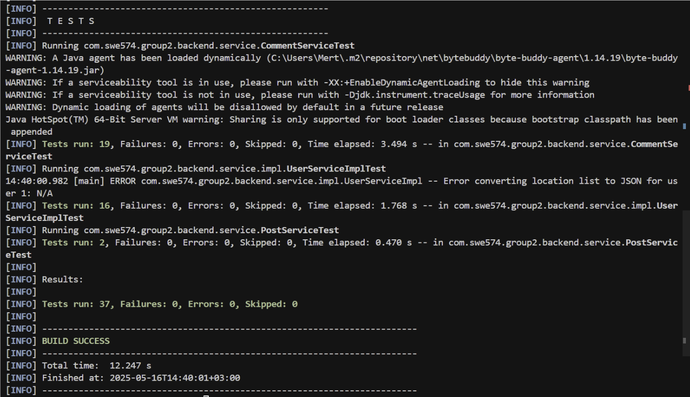

- Total Unit Tests: **37**
- Passed: **37**
- Failed: **0**
- Errors: **0**
- Skipped: **0**

### Missing Unit Tests

**ReportService:**  
There were no unit tests for generating, listing, or deleting reports.

**NotificationService:**  
Basic features like sending, listing, marking as read are untested.

**FollowerNotificationService:**  
There are no tests for operations such as sending follower-related notifications or managing user preferences for notifications.

**FollowedUserService:**  
Tests do not cover fundamental social features including following/unfollowing users.

**FollowedPostService:**  
Post-following actions are not covered by tests. There’s no validation for following or unfollowing posts or viewing followed content.

**MysteryObjectService:**  
The mystery object does not cover basic unit tests for creation, updating and retrieval.

### Partially Tested Services

#### PostServiceTest

- There are no tests for post deletion or edit.  
- Tagging operations have not been verified.

#### CommentServiceTest

- Comment deletion is not tested.  
- There are no tests for reporting comments.  
- Comment multimedia uploads and search/filter functionalities are not verified.

#### UserServiceImplTest

- Social features like following users, viewing followers, or blocking/unblocking are not covered.

### 7.2 Manual Tests

#### 7.2.1. User Registration & Authentication

**Test Scenario:**  
Examined the flow where a new user registers with a unique username and password, then logs into and out of the platform.  

**Expected Outcome:**  
Successful registration should generate a new user profile, login should verify credentials and send the user to the page they are on and logout should send them to the main page.  

**Actual Result & Observations:**  
The registration form handled valid and invalid inputs correctly. It gave instant feedback (e.g., "username already exists"). After successful registration, login authentication worked as expected. Logging out redirected users to the main page.  

**Status:** Passed

---

#### 7.2.2. User Profiles & Badge Display

**Test Scenario:**  
Checked if users could view and edit their profile information (bio, profile picture) and whether earned badges were displayed correctly.  

**Expected Outcome:**  
Profile edits should be saved instantly, profile pictures uploaded successfully and earned badges should be visible on the user dashboard.  

**Actual Result & Observations:**  
In profile editing, changes like bio updates appeared immediately after saving. Profile picture uploads were tested images. Earned badges loaded correctly.  

**Status:** Passed

---

#### 7.2.3. Role-Based Access Control

**Test Scenario:**  
Validated whether regular users could perform actions like posting, commenting, and upvoting, while the admin had extended privileges to manage reported content.  

**Expected Outcome:**  
Role restrictions should prevent unauthorized actions (e.g., regular users shouldn't see moderation tools).  

**Actual Result & Observations:**  
Users could perform general actions with no issues. The admin account successfully accessed the report management panel and could resolve reports.  

**Status:** Passed

---

#### 7.2.4. Post Creation & Media Uploads

**Test Scenario:**  
Users were asked to create posts with mandatory fields (title, description, image) and test uploading media content in various formats.  

**Expected Outcome:**  
Posts should be created successfully, invalid inputs should trigger validation errors, and unsupported media formats should be rejected.  

**Actual Result & Observations:**  
Post creation with valid data succeeded as expected. Empty title/description fields were caught by validation. Media uploads worked with .png and .jpg files.  

**Status:** Passed

---

#### 7.2.5. Commenting System & Interaction

**Test Scenario:**  
Tested commenting, replying to comments, attaching media and using comment types (e.g., question, suggestion or story).  

**Expected Outcome:**  
Users should be able to interact through comments and replies, attachments should upload and comment types should display correctly.  

**Actual Result & Observations:**  
The commenting worked fine except for replies which duplicated the comment but nesting worked without issues at multiple levels. Media attachments (images) appeared within comments as intended. Comment types were clearly labeled and selectable during creation.  

**Status:** Passed

---

#### 7.2.6. Voting & Answer Recognition

**Test Scenario:**  
Examined whether users could upvote/downvote comments and posts and if post authors could mark helpful comments as 'Contributing Comment' for post resolution.  

**Expected Outcome:**  
Vote counts should update in real-time and solved comments should be highlighted for clarity.  

**Actual Result & Observations:**  
Voting interactions were responsive but counts did not update live without page refresh. Authors could successfully mark comments as 'Contributing Comment' which visually distinguished them with a badge and repositioned them in the resolution list.  

**Status:** Passed

---

#### 7.2.7 Search & Semantic Tagging

**Test Scenario:**  
Tested both semantic search and advanced filtering (tags, attributes). Also evaluated semantic tagging via Wikidata entity selection.  

**Expected Outcome:**  
Search results should be accurate and filters should refine results effectively. Tags should link to relevant Wikidata entities.  

**Actual Result & Observations:**  
Semantic search returned relevant results. Advanced filters (by color, material, etc.) worked without issues. Tagging via Wikidata suggested appropriate entities based on user input.  

**Status:** Passed

---

#### 7.2.8. Notifications & Moderation

**Test Scenario:**  
Users should receive notifications for interactions (comments, upvotes, solution acknowledgments). Admin should be alerted about reported content.  

**Expected Outcome:**  
Real-time notifications should appear and link to relevant content. Reporting should be functional for users and reported content should be accessible by the admin.  

**Actual Result & Observations:**  
Notifications were displayed in real-time. Reporting inappropriate content worked without issues and the admin could view and resolve reports via the admin panel.  

**Status:** Passed

---

#### 7.2.9. Badge System

**Test Scenario:**  
Validated whether user contributions lead to badges awarded upon reaching specific milestones.  

**Expected Outcome:**  
Badges should appear dynamically on the user profile.  

**Actual Result & Observations:**  
Badges are updated correctly after actions like posting, commenting and voting. They were awarded and reflected on the profile page.  

**Status:** Passed

## 8. Individual Contributions for [Melih Güney](https://github.com/rmguney)

- [8.1. Executive Summary](#81-executive-summary)
- [8.2. Major Implementations](#82-major-implementations)
  - [8.2.1. Frontend Base and Integrations with the New Backend APIs](#821-frontend-base-and-integrations-with-the-new-backend-apis)
  - [8.2.2. Mobile Build and Pipelines](#822-mobile-build-and-pipelines)
  - [8.2.3. Post Creation, Display, and Resulotion Features](#823-post-creation-display-and-resulotion-features)
  - [8.2.4. Multiple UX Overhauls and Bugfixes](#824-multiple-ux-overhauls-and-bugfixes)
- [8.3. Code Reviews for Major PRs](#83-code-reviews-for-major-prs)
- [8.4. Documentation](#84-documentation)

### 8.1. Executive Summary

Main contributions include:

- Frontend base and features that are in the last semester's project, and their API integrations into the current backend.
- Structuring of the frontend code and its compatibility to the mobile build. Solely responsible for mobile.
- Multiple major feature implementations, UX overhauls after each sprint, bugfixes, consistency fixes, etc.
- Group communication, planning, repository, documentation, issues, and code management and reviews.

Statistics summary:

- [69 issues created](https://github.com/rmguney/swe574-2025s-g2/issues?q=is%3Aissue%20state%3Aopen%20author%3Armguney)
- [70 issues resolved](https://github.com/rmguney/swe574-2025s-g2/issues?q=is%3Aissue%20state%3Aopen%20assignee%3Armguney)
- [50 commits merged to main](https://github.com/rmguney/swe574-2025s-g2/graphs/contributors)
- [49 pull requests reviewed and merged](https://github.com/rmguney/swe574-2025s-g2/pulls?q=is%3Apr+is%3Aclosed)

### 8.2. Major Implementations

This section will cover only the major features implemented. For a full list of contributions kindly refer to the commit or issue history. Listing is provided in a relevant umbrella topics and issues are in chronological order based on issue enumartion. Links for the issues are provided in this report via markdown hyperlinks, and all the related pull requests are linked in each individual issue page.

### 8.2.1. Frontend Base and Integrations with the New Backend APIs

Frontend components and features including post creation and display, login and register, user profiles, and wikidata tagging that are covered with the last semester's requirements and shared with this semester's requirements aswell. Therefore last semester's frontend base was used to build upon:

[merge the frontend project from last year to this repo #10](https://github.com/rmguney/swe574-2025s-g2/issues/10)

And then merged with the new backend. Main issue for integrating the RESTful APIs of multiple features (consists of sub-issues):

[api integrations with the frontend #14](https://github.com/rmguney/swe574-2025s-g2/issues/14)

Following functionalities are added throughout this phase:

- Registeration and login
- User profile pages
- Post creation, display, and details
- Commenting under posts
- Voting for posts and comments
- Basic resolution
- Basic search and filter

### 8.2.2. Mobile Build and Pipelines

Following issues are about creating a mobile build pipeline and building the mobile application. Combined with the frontend structure, mobile native implementations, and mobile specific CSS code, they allow a Gradle Android application to be built. Top 5 most impactful ones can be found below:

- [initialize capacitor.js for compiling gradle app for mobile #24](https://github.com/rmguney/swe574-2025s-g2/issues/24)
- [modify shared frontend components for better mobile display #27 (multiple sub-issues)](https://github.com/rmguney/swe574-2025s-g2/issues/27)
- [get the first .apk build ready #74](https://github.com/rmguney/swe574-2025s-g2/issues/74)
- [prepare android configs for faster iteration #105](https://github.com/rmguney/swe574-2025s-g2/issues/105)
- [frontend fixes and mobile build #238](https://github.com/rmguney/swe574-2025s-g2/issues/238)

### 8.2.3. Post Creation, Display, and Resulotion Features

In addition to the main functionalities of post creation and display that are from the base frontend features, covered in the previously mentioned issues, top 10 most significant implementations in this corresponding topic include:

- [add multimedia support to both post creation page and post display #113](https://github.com/rmguney/swe574-2025s-g2/issues/113)

  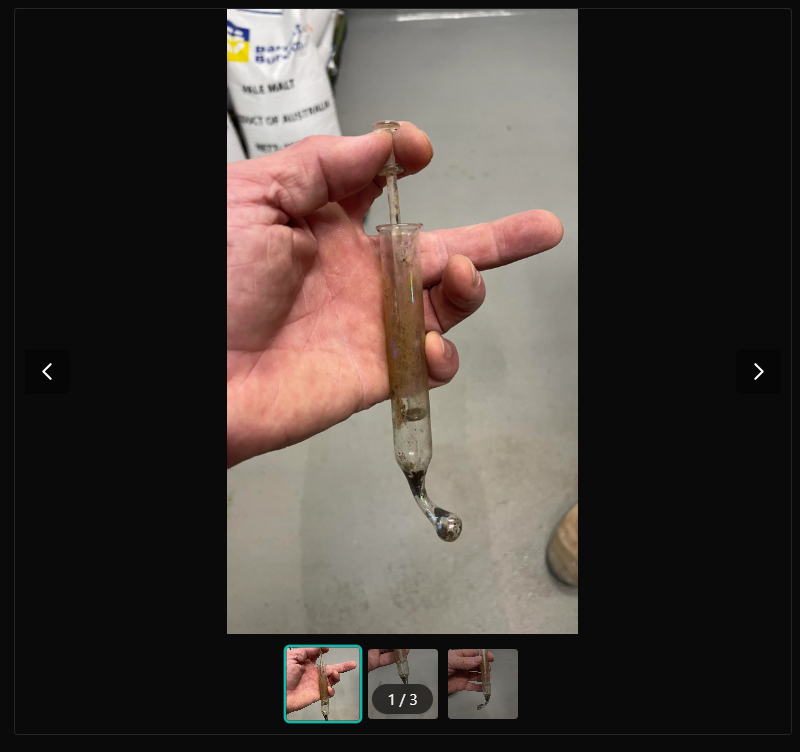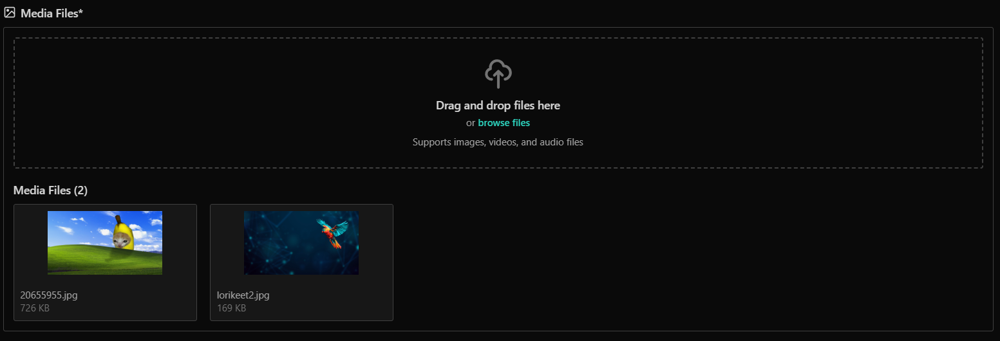

  - Functionality: Allows the uploading and displaying of multiple image, audio and video files.
  - Requirements covered:
    > 1.2.2. Media Upload
    > 1.2.2.1. Users should be able to upload multi-media files like images or videos as mandatory and audio as optional to accompany their posts.
    > 1.2.2.2. The system should support common media formats.

- [enhance user profile #117](https://github.com/rmguney/swe574-2025s-g2/issues/117)

  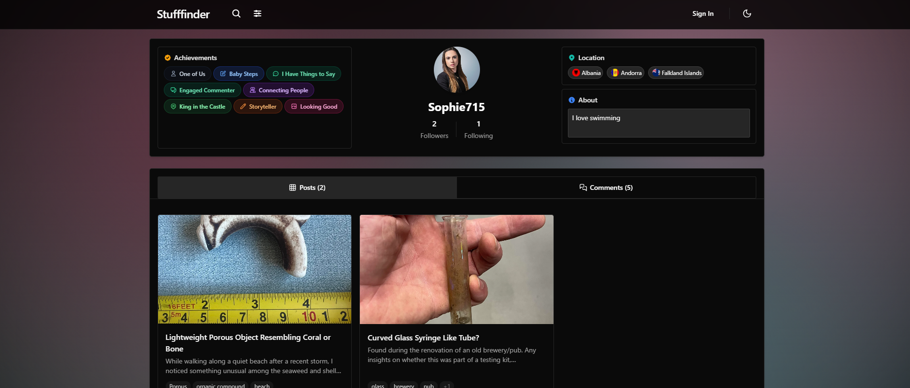

  - Functionality: Allows users to take actions on their profile page such as bio, location, profile picture and review posts and comments, visual overhaul is also included
  - Requirements covered:
    > 1.1.2. User Profiles
    > 1.1.2.1. When successfully registered, the system should create a user profile containing mandatory fields such as username and email address.
    > 1.1.2.2. Users should be able to add a biography information as optional to their profile.
    > 1.1.2.3. Users should be able to upload a profile picture.
    > 1.1.2.4. Users should be able to update their profile information from the profile page.
    > 1.1.2.5. Users should be able to view the badges they have earned from the profile page.

- [post creation - color should be chosen from color wheel #118](https://github.com/rmguney/swe574-2025s-g2/issues/118)

  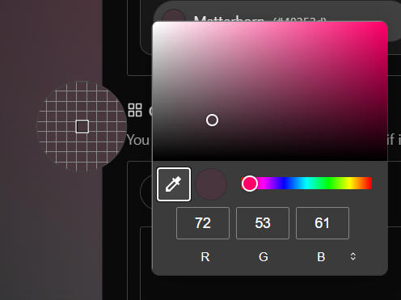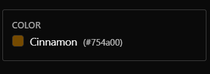

  - Functionality: Allows the users to select colors instead of writing a text, and pick exact colors for their objects
  - Requirements covered:
    > 1.2.1.2. Users should have the option to provide additional structured details about the mystery object, categorized as follows:
    > Physical Characteristics: ... color

- [materials selection suggestions #130](https://github.com/rmguney/swe574-2025s-g2/issues/130)

  

  - Functionality: Allows the users to search wikidata for picking their object material
  - Requirements covered:
    > 1.2.1.2. Users should have the option to provide additional structured details about the mystery object, categorized as follows:
    > Physical Characteristics: Material ...

- [display contributors credited in the solution summary #145](https://github.com/rmguney/swe574-2025s-g2/issues/145)

  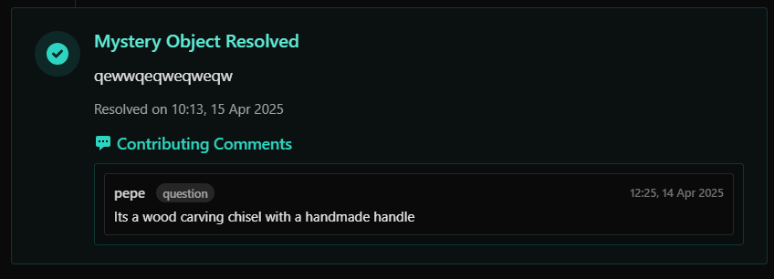

  - Functionality: Displays the contributing comments to the post resolution
  - Requirements covered:
    > 1.2.3.4. The post owner should acknowledge and credit the users who commented or contributed in solving the mystery by manually selecting them. The system should highlight their input in the solution summary.

- [implement Badge System #149](https://github.com/rmguney/swe574-2025s-g2/issues/149)

  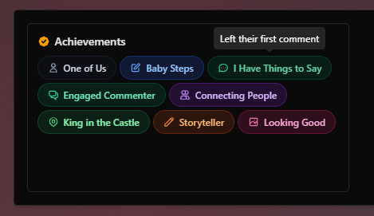

  - Functionality: Achievements for user interactions
  - Requirements covered:
    > 1.6.Reputation and Badge System
    > 1.6.1. The system must implement a merit-based reputation system where users earn points for valuable contributions, such as helping to solve posts.
    > 1.6.2. Badges must reflect activity-based contributions and cannot be self-declared.
    > 1.6.3. The system must prevent abuse by introducing increasing thresholds for point accumulation.

- [handling of wikidata tags #180](https://github.com/rmguney/swe574-2025s-g2/issues/180)

  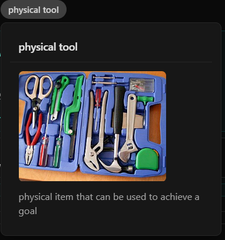

  - Functionality: Informative texts and image fetched from the wikidata API
  - Requirements covered:
    > 1.4.2. Tagging
    > 1.4.2.1. Users should have the ability to tag posts with relevant keywords to facilitate organized navigation and improve searchability.
    > 1.4.2.2. The system should support the creation, management of tags and should allow users to use semantic tags linked to Wikidata
    > 1.4.2.3. Tagging and searching are separate but interconnected features:
    > Tagging helps categorize mystery objects for better organization.
    > Searching retrieves objects based on input criteria. For example, including tags, text, and metadata.

- [sorting and filtering functionality for comment types #192](https://github.com/rmguney/swe574-2025s-g2/issues/192)

  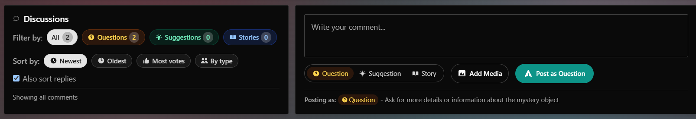

  - Functionality: Allows users to post, filter and sort comments in a structured manner
  - Requirements covered:
    > 1.3.1. Commenting System
    > 1.3.1.1. Users should be able to select a comment type when adding a comment, such as question, hint, answer suggestion, or personal experience related to the object's usage in their life.
    > 1.3.1.2. The system should support threaded comments to have organized discussions and replies.
    > 1.3.1.3. The system should support various types of interactions for comments. For example, discussions, expert opinions, speculative answers and solution proposal.
    > 1.3.1.4. The system should support multi-media content for comments and should allow users to attach multiple images to illustrate their points and provide visual evidence.

- [sorting, filtering and pagination for home page #196](https://github.com/rmguney/swe574-2025s-g2/issues/196)

  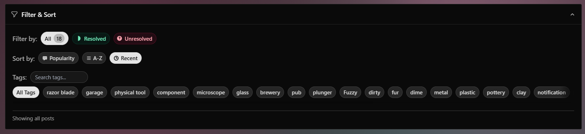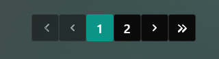

  - Functionality: Allows users to discover posts with their specific preferences
  - Requirements covered:
    > 1.4.1. Search Functionality
    > Tags (user-defined tags and semantic tags from Wikidata)
    > 1.4.1.5. Search results should be sortable and filterable based on these options:
    > 1.4.1.5. Search results should be sortable and filterable based on these options:
    > Date (newest to oldest or oldest to newest)
    > Status (solved/unsolved objects)
    > Most Trending (most upvotes)

- [post recommendation feature #219](https://github.com/rmguney/swe574-2025s-g2/issues/219)

  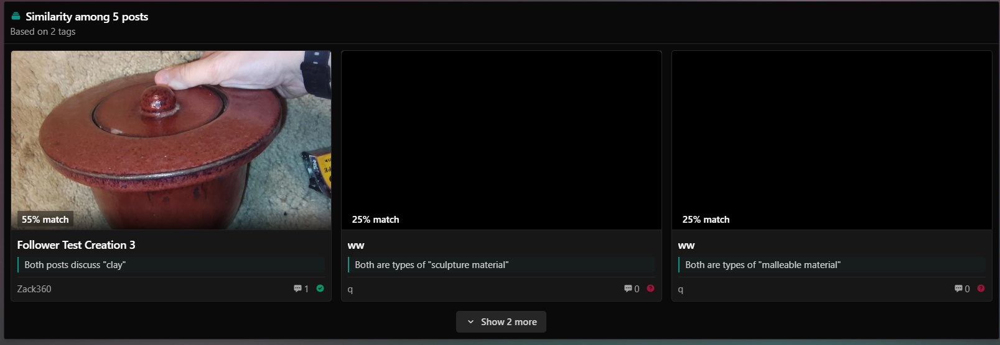

  - Functionality: Displays similar posts in the post details page
  - Requirements covered:
    > 1.4.2.4. The system should recommend posts to the users based on Wikidata tags.

- [graceful error handling checks for the entire website #230](https://github.com/rmguney/swe574-2025s-g2/issues/230)

  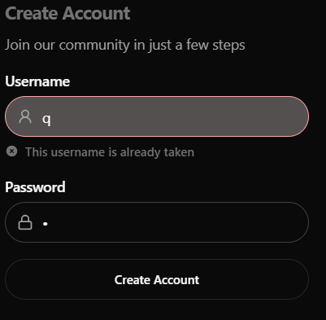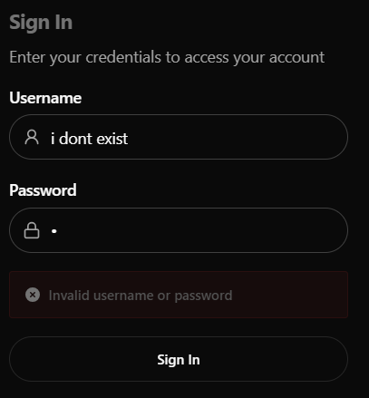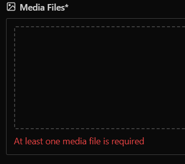

  - Functionality: Displays actionable error messages across the website functionalities
  - Requirements covered:
    > General usability and user friendliness.

### 8.2.4. Multiple UX Overhauls and Bugfixes

Two complete UX overhauls are done to ensure a working mobile build, mobile compatbility, and proper user experience:

- [design overhaul for post details page #190](https://github.com/rmguney/swe574-2025s-g2/issues/190)

  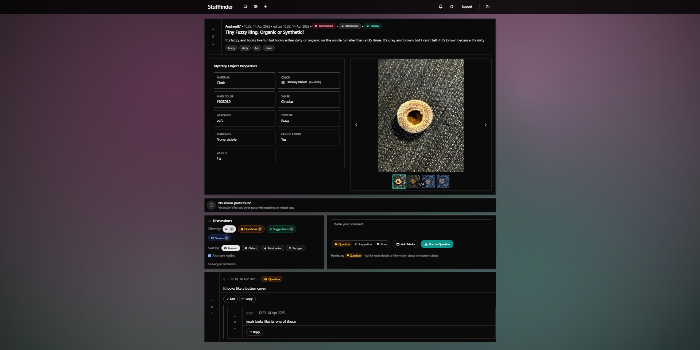

- [visual bugs, consistency checks, and ux overhaul for the entire website #206](https://github.com/rmguney/swe574-2025s-g2/issues/206)

  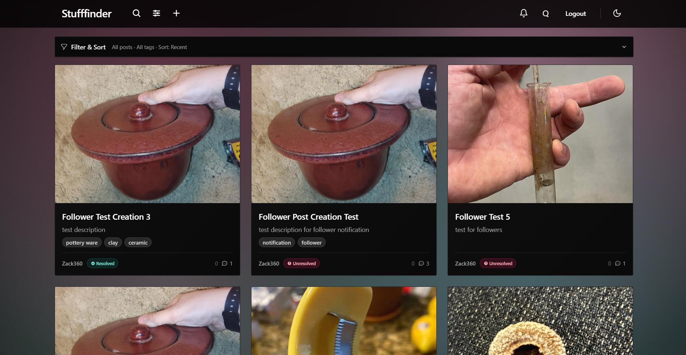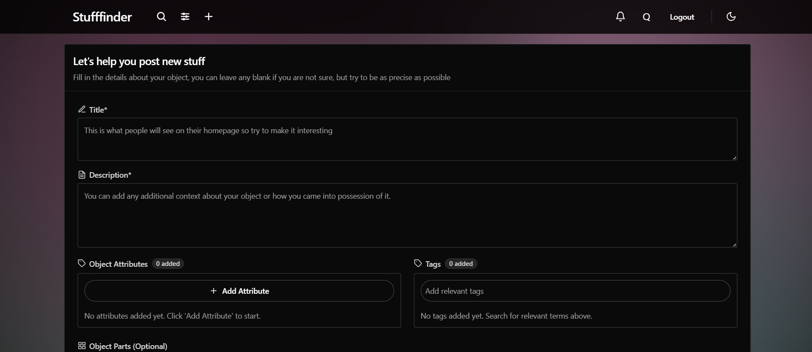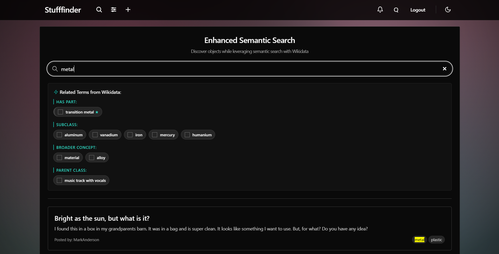

Other bugfixes and less comprehensive visual reworks are not included in this section.

### 8.3. Code Reviews for Major PRs

Listed in this section, are only the top 10 that could be considered significant. For the full list please refer to the [pull requests page](https://github.com/rmguney/swe574-2025s-g2/pulls?page=4&q=is%3Apr+is%3Aclosed).

- [#32 - notifications fully implemented #57](https://github.com/rmguney/swe574-2025s-g2/pull/57)

  - Author: Mustafa
  - Functionality: Notifications system implementation
  - Resolution: Merged without significant issues

- [implemented semantic search through wikidata api #102](https://github.com/rmguney/swe574-2025s-g2/pull/102)

  - Author: Mustafa
  - Functionality: Semantic searching
  - Resolution: Merged without significant issues

- [122-subpart #155](https://github.com/rmguney/swe574-2025s-g2/pull/155)

  - Author: Mustafa
  - Functionality: Mystery Object Parts
  - Resolution: Merged without significant issues

- [edit post functionality for the author #127](https://github.com/rmguney/swe574-2025s-g2/issues/127)

  - Author: Mustafa
  - Functionality: Editing the post after being created
  - Resolution: Merged without significant issues

- [Post Resolution #164](https://github.com/rmguney/swe574-2025s-g2/pull/164)

  - Author: Esmatullah
  - Functionality: Part of post resolution functionality
  - Resolution: Significant issues, change requested and not merged

- [121-resolution #188](https://github.com/rmguney/swe574-2025s-g2/pull/188)

  - Author: Mustafa
  - Functionality: Part of post resolution functionality
  - Resolution: Merged without significant issues

- [Implement post and user follow feature 209 #221](https://github.com/rmguney/swe574-2025s-g2/pull/221)

  - Author: Mert
  - Functionality: Follow feature
  - Resolution: Issues of moderate severity, irrelevant changes to the code preventing review, not changed but merged after a long confirmation process

- [Advanced-search #235](https://github.com/rmguney/swe574-2025s-g2/pull/235)

  - Author: Mustafa
  - Functionality: Advanced search
  - Resolution: Merged without significant issues

- [Unit tests implemented for Comment, Post and User services #236 #237](https://github.com/rmguney/swe574-2025s-g2/pull/237)

  - Author: Mustafa
  - Functionality: Unit tests
  - Resolution: Merged without significant issues

- [Implement reporting and moderation tools with admin panel 201 #240](https://github.com/rmguney/swe574-2025s-g2/pull/240)

  - Author: Mert
  - Functionality: Reporting functionality and moderation panel
  - Resolution: Same repeated issues as the pull request #211 one but more severe. Changes were requested but got denied by the author. Had to merge it in and meticulously bugfix due to last minute delivery, due to having very little time left until final presentation

### 8.4. Documentation

Top 3 contributions on documentation, all being as inclusive as possible since there are too many entries and edits:

- [Reviews and edits for entirety of the Wiki pages, many significant re-writes and authoring of several others](https://github.com/rmguney/swe574-2025s-g2/wiki)
- [69 issues created and many others reviewed and edited](https://github.com/rmguney/swe574-2025s-g2/issues?q=is%3Aissue%20state%3Aopen%20author%3Armguney)
- [Co-authored reports for milestone 1,2 and the majority of this final report, and milestone releases along with their release notes](https://github.com/rmguney/swe574-2025s-g2/tree/main/reports)

## 9. Individual Contributions for [Mustafa Bektaş](https://github.com/mustafa-bektas)


## 10. Individual Contributions for [Mert Ünlü](https://github.com/MertUnlu-SWE)

### Executive Summary

Throughout project, I focused on to the documentation, GitHub Wiki Pages and issue tracking. I also supported for both backend and frontend functionality, user/post follow feature, reporting feature with admin panel.

---

### Key Contributions

| Requirement                          | Description                                                                             | Links                    |
| ------------------------------------ | --------------------------------------------------------------------------------------- | ------------------------ |
| User/Post Follow                     | Developed follow/unfollow feature allowing users to follow both other users and individual posts. | [Issue #209](https://github.com/rmguney/swe574-2025s-g2/issues/209) |
| Reporting Content With Admin Panel   | Implemented reporting functionality for posts, comments and users. Developed admin panel and notification for displaying reported contents. Implemented admin report resolution.             | [Issue #201](https://github.com/rmguney/swe574-2025s-g2/issues/201)           |
| Better Post Display                  | Updated the post display for providing more information in a more user-experience focussed.                             | [Issue #138](https://github.com/rmguney/swe574-2025s-g2/issues/138)              |

---

### Testing & Issues

- Manually tested user and post follow/unfollow functionality with various accounts.
- Faced challenges with 403 forbidden errors and fixed by getting the username instead of email.
- Manually tested reporting feature with various scenarios such as comment reporting, post reporting and user reporting.
- Manually tested Admin panel with report resolution system with different scenarios such as sending a warning, removing content (post, comment) and banning the user.
- Faced challenges with getting user role from cookie and displaying the admin panel icon.

---

### Code Reviews

| Reviewer   | PR Reviewed                | Result                                   |
| ---------- | -------------------------- | ---------------------------------------- |
| Mert Ünlü  | [location and bio doesnt display unless you login as the target user](https://github.com/rmguney/swe574-2025s-g2/pull/224)          | Approved the bug fix |

---

### Major Pull Requests

| PR Number | Title                      | Description                          | Link                |
|-----------|----------------------------|--------------------------------------|---------------------|
| #167       | Merge better post display           | Short description of the PR content  | [PR #167](https://github.com/rmguney/swe574-2025s-g2/pull/167)        |
| #173       | 123 sorting filtering and pagination for search results and homepage           | Another description                  | [PR #173](https://github.com/rmguney/swe574-2025s-g2/pull/173)        |
| #220       | sorting, filtering and pagination for search result page implemented           | Short description of the PR content  | [PR #220](https://github.com/rmguney/swe574-2025s-g2/pull/220)        |
| #221       | Implement post and user follow feature 209           | Another description                  | [PR #221](https://github.com/rmguney/swe574-2025s-g2/pull/221)        |
| #240       | Implement reporting and moderation tools with admin panel 201           | Another description                  | [PR #240](https://github.com/rmguney/swe574-2025s-g2/pull/240)        |

---

### Issues Created / Assigned

| Type     | Title                        | URL      |
| -------- | ---------------------------- | -------- |
| Assigned | wipe database and re-repopulate with meaningful posts        | [#239](https://github.com/rmguney/swe574-2025s-g2/issues/239) |
| Assigned | FollowedUserController.isFollowing throws exception when visiting a profile without logging in        | [#223](https://github.com/rmguney/swe574-2025s-g2/issues/223) |
| Created  | implement post and user follow feature | [#209](https://github.com/rmguney/swe574-2025s-g2/issues/209) |
| Assigned | implement post and user follow feature        | [#209](https://github.com/rmguney/swe574-2025s-g2/issues/209) |
| Assigned | Implement reporting and moderation tools with admin panel        | [#201](https://github.com/rmguney/swe574-2025s-g2/issues/201) |
| Created  | implement badge system | [#149](https://github.com/rmguney/swe574-2025s-g2/wiki/12.-Responsibility-Assignment-Matrix) |
| Created  | show solution summary block below solved posts | [#147](https://github.com/rmguney/swe574-2025s-g2/issues/147) |
| Created  | display contributors credited in the solution summary | [#145](https://github.com/rmguney/swe574-2025s-g2/issues/145) |

---

### Documentation Contributions

- Documented [weekly meeting notes and progress tracking](https://github.com/rmguney/swe574-2025s-g2/wiki/01.-Meeting-Notes-and-Progress-Tracking) on the wiki page
- Documented [User Scenarios wiki page](https://github.com/rmguney/swe574-2025s-g2/wiki/02.-User-Scenarios)
- Gathered and created [Requirements wiki page](https://github.com/rmguney/swe574-2025s-g2/wiki/03.-Requirements)
- Documented [issue](https://github.com/rmguney/swe574-2025s-g2/wiki/04.-Issue-Guideline) and [commit](https://github.com/rmguney/swe574-2025s-g2/wiki/05.-Commit-Structure-Guideline) guideline for the team
- Created [Project Plan wiki page](https://github.com/rmguney/swe574-2025s-g2/wiki/11.-Project-Plan)
- Created [Responsibility Assignment Matrix wiki page](https://github.com/rmguney/swe574-2025s-g2/wiki/12.-Responsibility-Assignment-Matrix)
